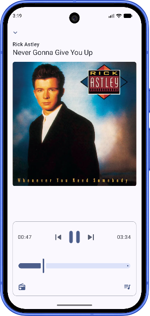

# OnlyMusic

OnlyMusic is a modern Android music player built with Jetpack Compose. It provides a responsive interface for searching for songs, playing results, and starting a song radio with related tracks.

> **Project status:** OnlyMusic is under active development. Features, playback behavior, and supported services may change over time.

## Features

- Modern, responsive UI built with Jetpack Compose
- Fast song search
- Direct playback from search results
- Song radio for continuously playing related tracks
- Long-press actions for additional song options
- Integration with the [NewPipe Extractor](https://github.com/TeamNewPipe/NewPipeExtractor)
- Lightweight architecture designed for future extensibility
- Smooth animations and a simple user experience

## Screenshots

<p align="center">
  
</p>

## Requirements

Before building OnlyMusic, make sure you have:

- Android Studio Ladybug or newer
- A compatible JDK version configured for the project
- Android SDK and build tools required by the project
- An Android emulator or physical device for testing

The exact SDK and JDK requirements are defined by the project's Gradle configuration.

## Getting started

### Clone the repository

```bash
git clone https://github.com/crazo7924/OnlyMusic.git
cd OnlyMusic
```

### Open the project

1. Open the project in Android Studio.
2. Allow Android Studio to sync the project with Gradle.
3. Resolve any missing SDK or dependency requirements.
4. Connect an Android device or start an emulator.
5. Run the app using the `app` configuration.

### Build from the command line

On macOS or Linux:

```bash
./gradlew assembleDebug
```

On Windows:

```powershell
.\gradlew.bat assembleDebug
```

The generated APK can be found in the appropriate `app/build/outputs/apk/` directory.

## How to use

1. Open OnlyMusic.
2. Use the search bar to find a song.
3. Tap a search result to begin playback.
4. Long-press a result to open the available context-menu actions.
5. Choose the song radio option to play related tracks continuously.

## Playback and content sources

OnlyMusic uses the NewPipe Extractor library to retrieve information and playback data from supported third-party services.

OnlyMusic does not host or distribute the audio content itself. Content availability and playback reliability may depend on:

- The upstream service
- Network connectivity
- Changes to upstream APIs or website behavior
- Regional availability
- The version of the extractor library

Playback may stop working temporarily when an upstream service changes its implementation. Updating the extractor dependency or the application may be required in such cases.

Users are responsible for complying with the terms of service, copyright laws, and other applicable regulations in their jurisdiction.

## Troubleshooting

### Gradle sync fails

Try the following:

1. Confirm that Android Studio and the required SDK components are installed.
2. Verify that the configured JDK is compatible with the project.
3. Run Gradle again with a refreshed dependency cache:

```bash
./gradlew --refresh-dependencies
```

### Search or playback fails

- Check your internet connection.
- Try searching for a different song.
- Restart the application.
- Check whether the upstream service is currently available.
- Update to the latest version of OnlyMusic.
- Check the project's issues for known extractor or playback problems.

### JitPack dependency resolution fails

If a dependency hosted on JitPack cannot be resolved:

- Check your internet connection.
- Confirm that the required repository is included in the project's Gradle configuration.
- Verify that the dependency version exists.
- Refresh the Gradle dependency cache and sync the project again.

## Roadmap

Potential future improvements include:

- Improved queue and playlist management
- Background playback improvements
- Media notification and lock-screen controls
- Search history
- More playback controls
- Better error handling
- Additional UI customization
- Improved offline behavior, where supported
- More comprehensive testing

The roadmap is subject to change as development continues.

## Contributing

Contributions, suggestions, and bug reports are welcome.

To contribute:

1. Fork the repository.
2. Create a feature branch:

```bash
git checkout -b feature/your-feature
```

3. Make and test your changes.
4. Commit your work with a clear message:

```bash
git commit -m "Add your feature"
```

5. Push the branch and open a pull request.

When reporting a bug, include:

- Android version
- Device or emulator model
- Application version or commit
- Steps to reproduce the issue
- Relevant logs or screenshots
- The expected and actual behavior

## Acknowledgements

- [TeamNewPipe](https://github.com/TeamNewPipe) for the NewPipe Extractor library
- [NewPipe Extractor](https://github.com/TeamNewPipe/NewPipeExtractor) for its content-extraction functionality
- [Jetpack Compose](https://developer.android.com/compose) for the modern Android UI toolkit
- The Android and open-source communities

## Legal notice

OnlyMusic is an independent project and is not affiliated with or endorsed by the services accessed through the NewPipe Extractor library.

OnlyMusic does not host third-party content. Users are responsible for how they use the application and for ensuring that their use complies with applicable laws, copyright requirements, and the terms of service of any third-party service.

For information about the NewPipe Extractor license and usage requirements, refer to its [official repository](https://github.com/TeamNewPipe/NewPipeExtractor).

## License

OnlyMusic is licensed under the GNU Affero General Public License v3.0 or later.

See the [LICENSE](LICENSE) file for the complete license text.

[](https://www.gnu.org/licenses/agpl-3.0.html)
